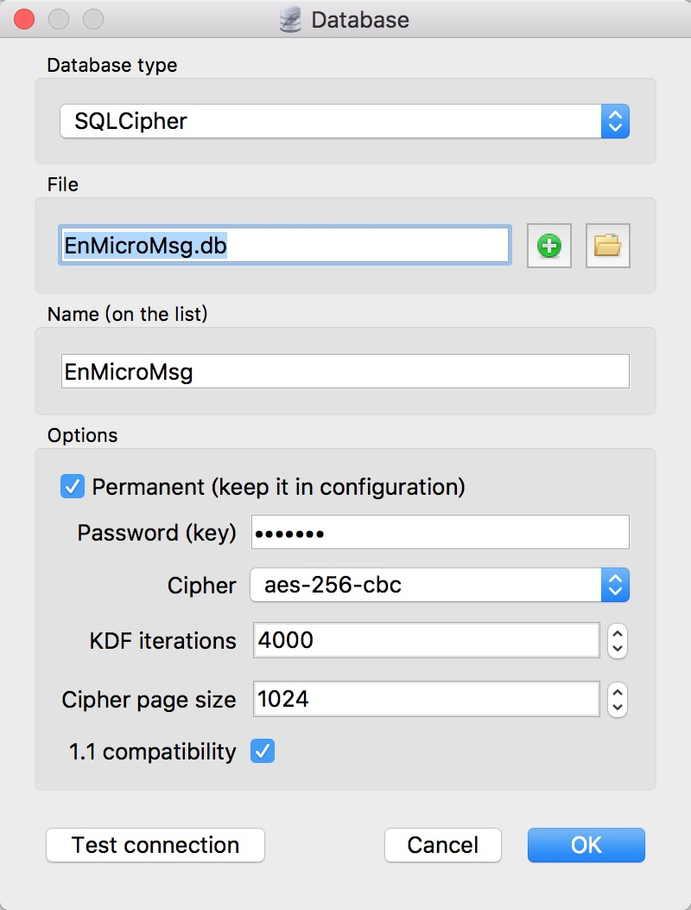

> 记录微信代码及文件生成、命名的相关规则 (Base Android)

### 用户数据存储位置

- 数据库文件 (聊天记录/朋友圈等)
    + /data/data/com.tencent.mm/MicroMsg/`{uidPath}`
- 资源文件 (图片/视频/语音等)
    + /sdcard/tencent/MicroMsg/`{uidSaltPath}`
- 6.x 的版本 uidPath = uidSaltPath
- 7.x 的版本 uidSaltPath 是随机生成的

#### uid

- `/data/data/com.tencent.mm/shared_prefs/auth_info_key_prefs.xml` 文件
    + 其中 key 为 `_auth_uin` 的值即为 uid

#### uidPath

- uidPath = md5(`mm` + `uid`)
- sample1:
    + uid: 1234567890
    + md5(`mm1234567890`) = fdf058fb758b9f9705c8d894d486e352
- sample2:
    + uid: -1234567890
    + md5(`mm-1234567890`) = 93db116453a64e6470b159be16da18e5

#### uidSaltPath

- `/data/data/com.tencent.mm/MicroMsg/{uidPath}/account.bin` 文件
    + 文件大小 1024 * 4 + 16 = 4112 字节
    + 前面 4096 字节为随机 byte, 记为 random_4096_byte
    + 后面 16 字节为 random_4096_byte 的 md5 值 (没有转化为 hexstr 的原始 byte)
- uidSaltPath = md5(`random_4096_byte` + `uid`)

```Java
MessageDigest md5 = MessageDigest.getInstance("MD5");
md5.update(random_4096_byte);
md5.update(Integer.toString(uid).getBytes());
byte[] saltByteMd5 = md5.digest();
String uidSaltPath = encodeHex(saltByteMd5)
```

### EnMicroMsg.db 密钥

- md5(`imei` + `uid`).substr(0, 7)
    + IMEI+UID 取 md5, 使用前 7 位作为密钥
- 如果你使用 `SQLiteStudio`，其配置如下



